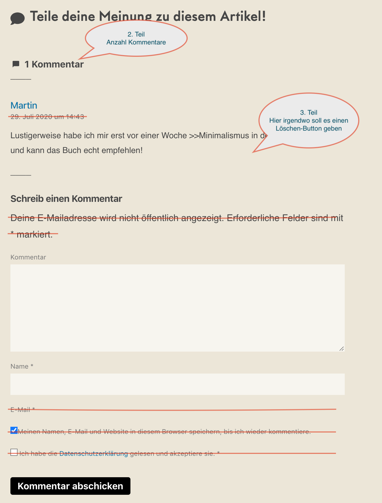

# Comments App

**Aufabe:**
Erstelle und deploye eine App, in der man Kommentare hinterlassen kannst. Im Screenshot unten kannst du ein Beispiel sehen. Die durchgestrichenen Elemente sind optional bzw. Bonus.

**1. Teil: Grundfunktionalität -> Nutzer können Kommentare hinterlassen**
* Kommentare werden direkt im state gespeichert
    * keine Datenbank
    * zunächst kein Localstorage notwendig 
    * => beim Neustarten der Seite gehen folglich alle Kommentare verloren
* Umsetzung:
    * das Formular zum Erstellen eines Kommentars soll folgendes enthalten
        * Name
        * Nachricht
        * KEINE Checkboxes notwendig (kann als Bonus gemacht werden)
    * Nach drücken des Buttons „Kommentar abschicken“ erscheint der Kommentar über dem Formular
        * Der Kommentar muss für diesen Teil KEIN Datum und KEINE Uhrzeit enthalten (kann aber)

**2. Teil: Anzeigen der Anzahl der Kommentare**
* Ganz oben in deiner App soll die Gesamt-Anzahl der Kommentare stehen
  
**3. Teil: Löschen der Einträge**
* Neben jedem Kommentar gibt es einen Button, mit dem dieser gelöscht werden kann (NICHT im Screenshot zu sehen)

## Bonus

**4. Teil : Speichern der Einträge in Localstorage**
* Kommentare sollen in localstorage gespeichert und beim Aufruf der App bzw. Website aus dem Localstorage geladen werden

**5. Teil**
* Implementiere auch die durchgestrichenen Sachen im Screenshot wie Datum/Uhrzeit, checkboxes usw.

**6. Teil**
* Lade bzw. fetche von folgender API die Kommentare in deine App: https://tiny-house-helden.de/api/comments.json
* sie sollen also in der UI gerendert bzw. angezeigt werden

# Sonstiges

**CSS**
* das Styling darf gerne ganz simpel sein und muss nicht so aussehen, wie auf dem Screenshot bzw. zu sehen ist
* du kannst gerne bootstrap oder Ähnliches verwenden, wenn du möchtest
* generell ist das Styling nicht so wichtig bei dieser Aufgabe

**Allgemeines**
* verwende vite um ein neues Projekt _im gleichen Ordner_  zu erstellen
* erstelle genügend Components und versuche nicht, deinen gesamten Code in eine Component zu packen
* Du kannst in Teams arbeiten
* es wäre super, wenn du zumindest Teil 1 der Aufgabe schaffen würdest
* Versuche unbedingt, deine App rechtzeitig zu deployen, auch wenn du noch nicht fertig bist
